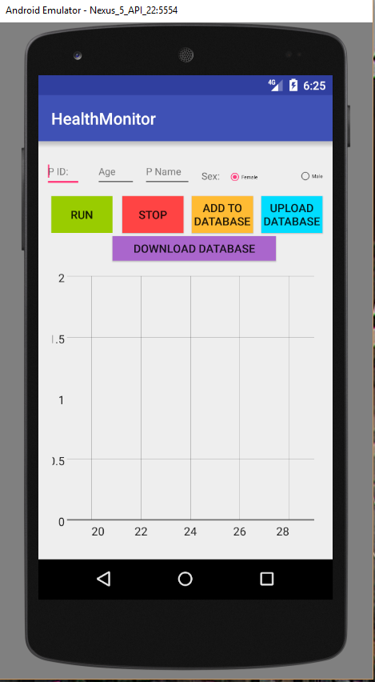
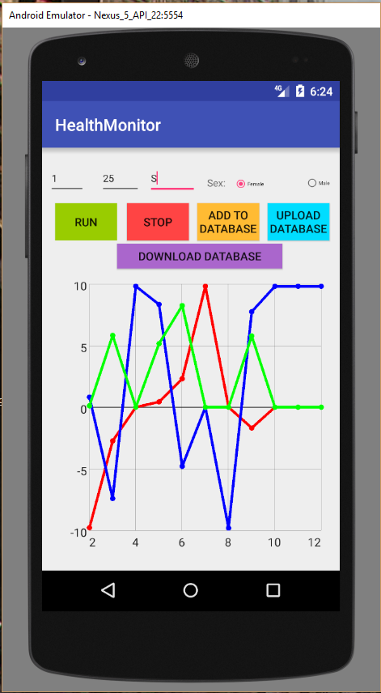

# HealthMonitorAppv2
Extension of health monitor app. Added database upload and sync.

Records accelerometer data and plots the graph in real time.

Creates and stores data for different users and also enables uploading of database to a web server and then downloads that data ( basically a sync function).

Screenshots of the app:

